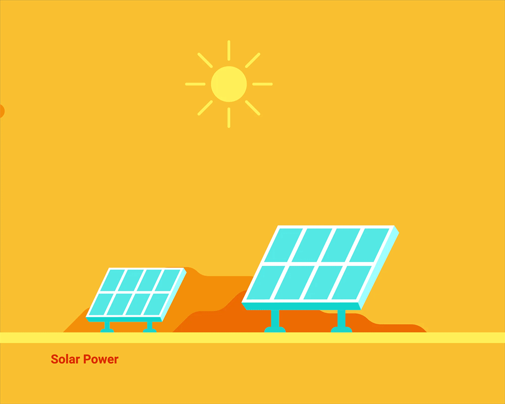

Group Project

Project Title:
The Dirty Hippy Proposal for Clean Solar Power

Description:
We are looking at the viability of personal solar cells placed on the roofs of homes in various cities across the United States, with a specific focus on the St. Louis.
Null Hypothisis:
Personal Solar Panels would have no benefit for personal use.

DataSets:
Google Project Sunroof CSV Files:
Projected power generated by roofs in searched aresas.
Projected CO2 offset.

Open Weather Map API:
Cloudiness of searched areas.

Power Consumption PDF:
Amount of electricty from Fossil Fuels, Nulcear Power, and Renewable energy by State.

3-5 Initial Research Questions:

Are personal solar panels a benefit for homeowners?
Fincial benefit of solar power v. cost of intilation
connect into weather database for cloud cover?
	
Does living in high denisty or low density housing make a difference?

How does a community benefit from personal solar panels for homeowners?
We might want a dataset showing where people get power from. As some people already get their power from rewnewable or nuclear sources. 
Measure of unused fossil fuels?
Higher air quality?

